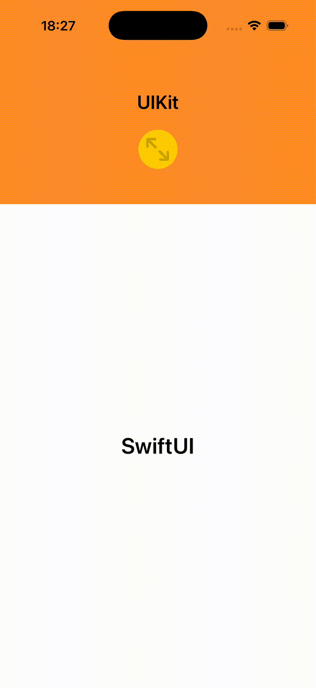

# Embedded

Ein Proof-of-Concept, wie ein `UIViewController` auf spezifische Weise in eine SwiftUI-App eingebettet werden kann.

## Übersicht

Diese Demo zeigt die Einbettung eines UIKit `UIViewController` in eine SwiftUI-Anwendung mit zwei verschiedenen Darstellungsmodi:

- **Embedded**: Der View Controller nimmt ein Drittel der Bildschirmhöhe ein (Portrait-Modus)
- **Fullscreen**: Der View Controller nimmt den gesamten Bildschirm ein (Landscape-Modus)

## Verwendung

Der gelbe Button im UIKit View Controller schaltet zwischen den Modi um. Der Wechsel erfolgt mit Animation. Auf einem iPhone wird zudem ein programmatischer Orientierungswechsel ausgeführt. 

## Besonderheiten

### Single Instance Pattern
Es wird **nur eine einzige Instanz** des eingebetteten View Controllers verwendet. Bei der Umschaltung zwischen den Modi wird derselbe View Controller wiederverwendet, nicht neu erstellt.

### Automatische Orientierungswechsel
- **Embedded**: Portrait-Orientierung
- **Fullscreen**: Automatischer Wechsel zu Landscape-Orientierung (nur iPhone)

Der Orientierungswechsel beim Umschalten zwischen den Modi erfolgt automatisch. Technisch wird dies über `UIWindowScene.requestGeometryUpdate()` gesteuert.

### FIXME

> requestGeometryUpdate UIInterfaceOrientationMask(rawValue: 24) error: Error Domain=UISceneErrorDomain Code=101 "The current windowing mode does not allow for programmatic changes to interface orientation." UserInfo={NSLocalizedDescription=The current windowing mode does not allow for programmatic changes to interface orientation.}

### Nahtlose Übergänge
Der Wechsel zwischen den Modi erfolgt mit einer nahtlosen und flüssigen Animation (`spring(duration: 0.3)`).

## Technische Implementierung

### Kernkonzepte
- **State Management**: SwiftUI `@State` für Fullscreen-Toggle und View Controller-Instanz
- **Geometry Changes**: Verwendung von `onGeometryChange` für responsive Layout-Berechnungen
- **Orientation Control**: Dynamische Steuerung der unterstützten Orientierungen via `supportedInterfaceOrientations`
- **UIViewControllerRepresentable**: Bridge zwischen SwiftUI und UIKit

### Dateien
- `EmbeddingApp.swift`: App-Einstiegspunkt
- `EmbeddingView.swift`: SwiftUI-Hauptansicht mit State-Management
- `EmbeddedViewController.swift`: UIKit View Controller und UIViewControllerRepresentable

## Lizenz

Copyright (c) 2026 Mikolas Bingemer

Dieses Projekt steht unter der [MIT-Lizenz](LICENSE).

